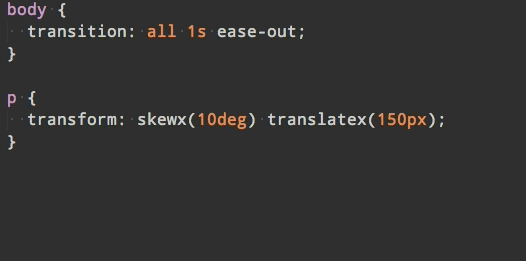

# sublime-autoprefixer

> Sublime plugin to prefix your CSS or SCSS

You shouldn't have to care about vendor prefixes. Now you don't have to!


---

<p align="center">✨</p>
<p align="center"><b>Support this project & level up your Sublime skills with this excellent <a href="https://SublimeTextBook.com/friend/AWESOME">Sublime Power User</a> course by Wes Bos</b><br>Try his free <a href="https://javascript30.com/friend/AWESOME">JavaScript 30</a> course for a taste of what to expect. Also check out his <a href="https://ES6.io/friend/AWESOME">ES6</a> and <a href="https://ReactForBeginners.com/friend/AWESOME">React</a> course.</p>
<p align="center">✨</p>

---




Adding prefixes manually is a chore. It's also hard to keep track of where and which prefixes are needed. This plugin uses the [Autoprefixer](https://github.com/postcss/autoprefixer) module to prefix properties and values according to the [Can I Use](http://caniuse.com) database. Which means it will only add the necessary prefixes and not bloat your stylesheet. It even lets you specify what browsers you want to target. In addition it will remove existing prefixes which are no longer needed.

Works with CSS and SCSS, but not other preprocessors.


## Install

Install `Autoprefixer` with [Package Control](https://packagecontrol.io) and restart Sublime.

**You need to have [Node.js](http://nodejs.org) 4+ installed.**<br>
Make sure it's in your $PATH by running `node --version` in your command-line.<br>
On macOS you need to make sure it's in `/usr/local/bin` or symlink it there.

See the Autoprefixer version in use [here](https://github.com/sindresorhus/sublime-autoprefixer/blob/master/node_modules/autoprefixer/package.json#L120).


## Getting started

In a CSS file, open the Command Palette *(<kbd>Cmd</kbd> <kbd>Shift</kbd> <kbd>P</kbd>)* and choose `Autoprefix CSS`. You can alternatively create one or more selections before running the command to only prefix those parts.

### Options

*(Preferences → Package Settings → Autoprefixer)*

You can specify which browsers you need to support using an array of rules.

See the [supported browser names](https://github.com/postcss/autoprefixer#browsers).

#### Default

```json
{
	"browsers": ["defaults"],
	"prefixOnSave": false
}
```

#### Example

```json
{
	"browsers": ["last 1 version", "> 10%", "> 5% in US", "ie 8", "ie 7"]
}
```

This will add the needed prefixes for the last version of each browser, all browsers with market share of more than 10% globally and 5% in the US, and Internet Explorer 7 and 8.

### Keyboard shortcut

You can also set up a keyboard shortcut to run the command by opening up "Preferences → Key Bindings - User" and adding your shortcut with the `autoprefixer` command.

Example:

```json
[
	{
		"keys": ["alt+super+p"],
		"command": "autoprefixer"
	}
]
```

### Project settings

You can override the default and user settings for individual projects. Just add an `"Autoprefixer"` object to the `"settings"` object in the project's `.sublime-project` file containing your [project specific settings](http://www.sublimetext.com/docs/3/projects.html).

Example:

```json
{
	"settings": {
		"Autoprefixer": {
			"browsers": ["last 1 version"]
		}
	}
}
```


## License

MIT © [Sindre Sorhus](https://sindresorhus.com)
